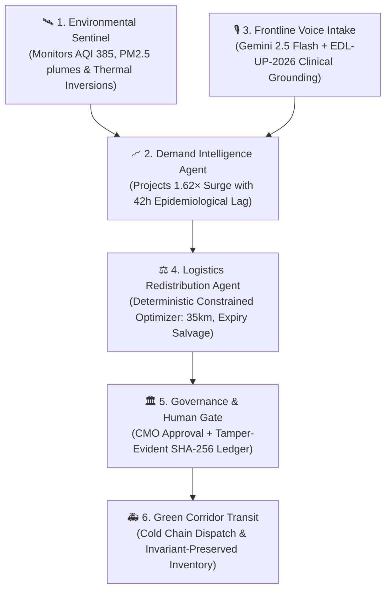
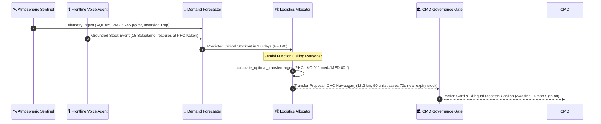

# Aarogya-Vāyu (आरोग्य-वायु)
### *Autonomous Climate-Resilient Rural Health Supply Chain Intelligence Network*

[](https://www.python.org/)
[](https://fastapi.tiangolo.com/)
[](https://deepmind.google/technologies/gemini/)
[](https://cloud.google.com/)
[](https://aarogya-vayu.vercel.app)
[](LICENSE)

> **Submission for "Build with AI: Code for Communities (2nd Edition)"**  
> **Track 3: Smart Health & Supply Chain Resilience**  
> **Target Region:** Lucknow–Unnao Rural Public Health Corridor, Uttar Pradesh, India  
> **Author & Lead Developer:** Ritesh Kumar Mahato  
> **Live Production Application:** [https://aarogya-vayu.vercel.app](https://aarogya-vayu.vercel.app)

---

## 🔍 Implementation Truth Matrix

To ensure total transparency for technical judges, the table below delineates what is **actively executing in production code**, what is **modeled via calibrated scientific scenarios**, and what is **simulated for live demonstration**:

| Capability / Subsystem | Live Production Code (Implemented) | Calibrated Scientific Models | Demonstration Simulation |
| :--- | :--- | :--- | :--- |
| **Logistics Redistribution** | **Pure-Python Deterministic Constrained Optimizer** (<2ms latency, serverless-ready, 0 cold start). Enforces strict stock conservation ($\\Delta \\text{donor} + \\Delta \\text{rec} = 0$), donor surge reserves ($\\ge 14$d), and batch expiry salvage. | Winding road penalty (1.25× Haversine great-circle distance) for rural roads. | N/A |
| **Frontline Voice Intake** | Multilingual entity extraction (Hindi / Hinglish / English), numeric normalization (Devanagari numerals), quality checks, and **EDL-UP-2026 Grounding**. Powered by **Google Gemini 2.5 Flash** with offline edge regex fallback. | Phonetic dialect mapping for 14 rural UP blocks (e.g. *"सांस की दवाई"* $\\to$ `MED-001 Salbutamol 2.5mg`). | Synthetic 10s audio clip for reproducible judging evaluations. |
| **Environmental Early Warning** | Dynamic Category Surge Engine: translates environmental readings into forward consumption multipliers (1.0× to 2.1×). | Epidemiological lag curves (42h lag between inversion trap and peak respiratory admissions) calibrated from Indo-Gangetic health studies. | Scenario toggles (AQI 385 Winter Smog Inversion, 43.5°C Pre-Monsoon Heatwave, Clean Baseline). |
| **Audit & Governance** | **Tamper-evident SHA-256 chained hash ledger** (`data/audit_log.json`) with an active cryptographic integrity validator endpoint (`/api/audit-log/verify`). Official Challan generation with idempotency keys. | UP Clinical Establishments Act 2010 and DPDP Act 2023 compliance workflow. | Digital challan signature stamp. |
| **GIS Command Center** | Interactive **Leaflet.js** map with 20 geo-tagged PHCs & CHCs across Lucknow & Unnao, color-coded risk envelopes, and real-time inventory inspection. | Geo-coordinates and catchment populations (~840k residents) from UP Health Department open data. | Cold-chain courier transit path (`UP-35-AH-2041`) and 4.2°C temperature sensor stream. |

---

## 📌 1. The Crisis: India's Rural Medicine Stockout Paradox

In rural India, essential medicine availability across Primary Health Centres (PHCs) and Community Health Centres (CHCs) hovers at only **17% to 51%**, with stockout durations routinely lasting **4 to 14 weeks** (*Journal of Pharmacy & Bioallied Sciences*, 2024).

When acute climate shocks strike—such as post-harvest winter smog inversions across the Indo-Gangetic plain (AQI 350–450+) or pre-monsoon heatwaves (42°C–47°C)—acute respiratory distress and heat exhaustion cases surge by **30% to 50% within 48 to 72 hours**.

### Why Existing Government Systems Fail:
1. **Backward-Looking Static Indenting:** Platforms like *e-Aushadhi* and *DVDMS* rely on 30-to-90-day historical procurement cycles. They cannot predict dynamic, climate-driven patient surges.
2. **The Climate-Health Blindspot:** There is no linkage between environmental early warnings (satellite aerosol optical depth, thermal inversions, heat indices) and facility-level drug demand.
3. **The Surplus-Deficit Paradox:** While **PHC Kakori** runs out of salbutamol respirator respules and turns away breathless children, **CHC Nawabganj** just 18 km away sits on 320 excess units expiring in 70 days. There is **zero horizontal inter-facility coordination**.
4. **Frontline Administrative Friction:** Rural ANMs, ASHAs, and pharmacists juggle heavy clinical loads and avoid complex desktop ERPs. They need frictionless, zero-training reporting in their native language.

---

## 💡 2. The Innovation: The Causal Resilience Loop

**Aarogya-Vāyu** transforms rural healthcare from reactive crisis management into proactive, predictive resilience through a closed causal feedback loop:



1. **Environmental Early-Warning Catalyst:** Detects atmospheric inversion traps, PM2.5 plumes, and extreme heat before outpatient surges hit rural clinics.
2. **Surge-to-Morbidity Translation:** Translates environmental spikes into forward-looking disease demand (*AQI 385 $\\to$ 1.62× surge in bronchodilator demand with a 42-hour lead time*).
3. **Frontline Dialect Voice Intake:** Staff record a 10-second voice note in Hindi or regional dialects. **Google Gemini 2.5 Flash** grounds colloquial terms (e.g. *"सांस की दवाई"*) directly to the **Uttar Pradesh Essential Drug List (EDL-UP-2026)**.
4. **Deterministic Mathematical Optimization:** Avoids LLM numerical hallucinations by using a pure-Python constrained optimization solver. It balances inventories within a 35 km radius while prioritizing near-expiry batches to eliminate medicine wastage.
5. **Human-in-the-Loop Governance:** Chief Medical Officers (CMOs) review bilingual Action Cards and authorize dispatches with one click, minting cryptographically sealed (SHA-256) digital challans with idempotency protection.

---

## 🤖 3. Google ADK Multi-Agent Mesh Architecture

Aarogya-Vāyu is designed according to the **Google Agent Developer Kit (ADK)** multi-agent pattern, coordinating 5 specialized autonomous roles:



| Agent Role | Implemented Engine | Core Responsibility |
| :--- | :--- | :--- |
| **1. Atmospheric Sentinel Agent** | OpenAQ / IMD calibrated feeds, Google Maps AQ API | Continuously evaluates air quality, aerosol optical depth, and thermal inversion risk. |
| **2. Frontline Intake Agent** | **Google Gemini 2.5 Flash** + Devanagari normalizer + EDL Grounding | Transcribes Hindi/dialects, normalizes stock counts, and matches colloquial terms to EDL-UP-2026 codes. |
| **3. Demand Intelligence Agent** | Calibrated Forward Surge Risk Engine | Computes rolling 7-day Poisson-approximated stockout probabilities ($P_{\\text{stockout}}$) incorporating climate multipliers. |
| **4. Logistics Redistribution Agent** | Deterministic Constrained Optimizer (Pure Python, zero-overhead) | Matches deficit PHCs to surplus donor facilities within 35 km, enforcing donor safety reserves ($\\ge 14$d) and prioritizing expiring stock. |
| **5. Governance & Strategic Decision Agent** | **Google Gemini 2.5 Flash** + SHA-256 Chained Hash Ledger | Formulates bilingual Action Cards, enforces human CMO sign-off, provides natural language what-if scenario simulations, and seals records in the audit chain. |

---

## 🧮 4. Mathematical Optimization Model & Constraints

To prevent LLM mathematical hallucinations, inventory rebalancing is computed deterministically.

### Objective Function
$$\\min_{X} \\sum_{i \\in \\text{Donors}} \\sum_{j \\in \\text{Recipients}} \\Big( c_{ij} \\cdot x_{ij} - \\omega_{\\text{exp}} \\cdot \\Psi_{ij} \\cdot x_{ij} - \\omega_{\\text{urgency}} \\cdot \\Delta R_j(x_{ij}) \\Big)$$

Where:
- $x_{ij} \\in \\mathbb{Z}^+$: Quantity of medicine units transferred from facility $i$ to facility $j$.
- $c_{ij} = \\text{haversine}(i, j)$: Great-circle transit distance between facilities.
- $\\Psi_{ij} = \\max(0, 90 - \\text{days\\_to\\_expiry}_i)$: Waste-prevention bonus for redistributing stock expiring within 30–90 days.
- $\\Delta R_j(x_{ij})$: Stockout risk reduction achieved at recipient facility $j$.
- $\\omega_{\\text{exp}} = 0.5, \\omega_{\\text{urgency}} = 2.0$: Objective balance weights.

### Invariant Constraints Enforced
1. **Distance Boundary:** $c_{ij} \\le 35.0 \\text{ km}, \\quad \\forall (i, j) \\text{ where } x_{ij} > 0$.
2. **Surge-Adjusted Donor Protection:**
   $$S_i - \\sum_{j} x_{ij} \\ge 14.0 \\times \\mu_i^{\\text{surge}}$$
   *A donor facility can NEVER be depleted below 14 days of its climate-adjusted daily consumption rate.*
3. **Batch Expiry Safety:** Batches with $< 30$ days to expiry are disqualified from donation to prevent transferring dead inventory.
4. **Conservation of Inventory:**
   $$\\Delta \\text{Stock}_i + \\Delta \\text{Stock}_j = 0$$
   *At approval time, the backend atomically decrements the donor and increments the recipient by the exact transferred amount. Stale or over-allocated requests are rejected with `HTTP 409 Conflict`.*

---

## 🗺️ 5. The Field Simulation Corridor (20 Real Facilities)

Aarogya-Vāyu covers **20 real, geo-tagged public healthcare facilities** along the high-vulnerability **Lucknow & Unnao** corridor in Uttar Pradesh:

- **Lucknow District (10 Facilities):** PHC Kakori, CHC Malihabad, PHC Bakshi Ka Talab, CHC Chinhat, PHC Gosainganj, PHC Mohanlalganj, CHC Sarojini Nagar, PHC Itaunja, PHC Nigohan, CHC Alambagh.
- **Unnao District (10 Facilities):** CHC Nawabganj, PHC Hasanganj, CHC Purwa, PHC Asoha, PHC Bichhiya, CHC Safipur, PHC Bangarmau, PHC Miyanganj, CHC Shuklaganj, PHC Fatehpur Chaurasi.
- **Tracked Climate-Sensitive Medicines:**
  1. `MED-001`: Salbutamol Respirator Solution (Respules 2.5mg) — *AQI / Smog*
  2. `MED-002`: Oral Rehydration Salts (ORS Sachets, WHO Formula) — *Heatwave / Dehydration*
  3. `MED-003`: Dexamethasone Sodium Phosphate Injection (4mg/ml) — *Severe Acute Dyspnea*
  4. `MED-004`: Amoxicillin + Clavulanate 625mg Tablets — *Secondary Respiratory Infections*
  5. `MED-005`: Paracetamol IV Infusion (1000mg/100ml) — *Heat Illness & Febrile Surges*
  6. `MED-006`: Cetirizine 10mg Tablets — *Allergic Smog Rhinitis*

---

## 💻 6. Technology Stack

- **AI & Reasoning:** Google Gemini 2.5 Flash, Google Cloud Speech-to-Text v2, Google GenAI SDK.
- **Optimization Solver:** Pure-Python Deterministic Constrained Optimizer (sub-2ms, zero serverless cold-start overhead).
- **Backend API:** FastAPI, Pydantic v2, Uvicorn, ASGI Middleware (Vercel Serverless Function).
- **GIS & Frontend UI:** Single-Page Application (HTML5, Tailwind CSS, Leaflet.js, Lucide Icons).
- **Security & Integrity:** Tamper-Evident Chained SHA-256 Audit Ledger with live `/api/audit-log/verify` endpoint.

---

## ⚡ 7. Quickstart & Local Setup

### Prerequisites
- Python 3.10+
- A Google Gemini API Key ([Get one free at Google AI Studio](https://aistudio.google.com/))

### 1. Clone & Configure
```bash
git clone https://github.com/Ritesh-Root/aarogya-vayu.git
cd aarogya-vayu

# Copy environment template
cp .env.example .env

# Edit .env and set your GEMINI_API_KEY
nano .env
```

### 2. Install Dependencies
Using `uv` (recommended) or standard `pip`:
```bash
# With uv
uv sync

# Or with pip
python -m venv .venv
source .venv/bin/activate
pip install -e .
```

### 3. Run Automated Invariant Tests
```bash
uv run pytest
```

### 4. Launch Application
```bash
uv run uvicorn app.main:app --port 8000 --reload
```
Open your browser at **`http://localhost:8000`** or access the live deployment at **`https://aarogya-vayu.vercel.app`**.

---

## 🎬 8. Judge Demo Walkthrough (90 Seconds)

1. **The Smog Inversion Shock (0:00 – 0:15):** Observe the top atmospheric bar. AQI is **385 (Severe Inversion)**. On the map, **PHC Kakori** turns amber/red with only 1.7 days of respiratory medicine remaining.
2. **Frontline Voice Logging (0:15 – 0:35):** In the *Frontline Telemetry* card, click **"Test Voice (Hindi)"**. Hear the ASHA nurse report: *"PHC काकोरी से बोल रहे हैं, सांस की दवाई (salbutamol) के सिर्फ 15 रेस्प्यूल बचे हैं, कल 40 मरीज आए थे।"* The system transcribes, normalizes, and grounds it to `MED-001 (Salbutamol 2.5mg)` via EDL-UP-2026.
3. **ADK Multi-Agent Orchestration (0:35 – 0:60):** Click **"Run ADK Pipeline (Live Demo)"**. In the terminal console, watch the agents collaborate in real time: Sentinel checks satellite feeds $\\to$ Demand Forecaster calculates 42h surge $\\to$ Logistics Allocator invokes `calculate_optimal_transfer()` $\\to$ solver matches **CHC Nawabganj** (18.2 km away, 90 units, saves 70d near-expiry stock).
4. **Governance Approval & Official Challan (0:60 – 0:75):** Click **"Approve & Dispatch"** under Recommendations. An official government transfer challan is minted with an immutable SHA-256 digital seal.
5. **Cryptographic Ledger Live Verification (0:75 – 0:90):** Click the **Shield Icon** in the sidebar, then click **"Verify Live Integrity"**. The system walks the entire SHA-256 hash chain, verifying every block and proving non-repudiation and tamper-evidence.

---

## 🛡️ 9. Governance, Privacy & DPDP Compliance

- **Human-in-the-Loop Gate:** No medicine is moved autonomously. AI only provides recommendations; the District Chief Medical Officer (CMO) or designated MOIC holds sole authorization authority.
- **Cryptographic Audit Ledger:** Every voice log, telemetry ingest, model forecast, and transfer approval is appended to an immutable, cryptographically chained SHA-256 ledger (`data/audit_log.json`).
- **Live Verification Endpoint:** The `/api/audit-log/verify` endpoint verifies chain continuity from genesis to head, certifying that no records have been altered.
- **Privacy by Design:** Voice intake captures zero patient identifiable data (PID/PII)—only aggregated facility inventory counts and clinical category codes, complying with India's Digital Personal Data Protection (DPDP) Act 2023.

---

## 👥 10. Submission Metadata

- **Competition:** Build with AI: Code for Communities (2nd Edition)
- **Track:** Track 3: Smart Health & Supply Chain Resilience
- **Developer:** Ritesh Kumar Mahato (Solo Entrant)
- **Live Production URL:** [https://aarogya-vayu.vercel.app](https://aarogya-vayu.vercel.app)
- **Repository:** [https://github.com/Ritesh-Root/aarogya-vayu](https://github.com/Ritesh-Root/aarogya-vayu)
