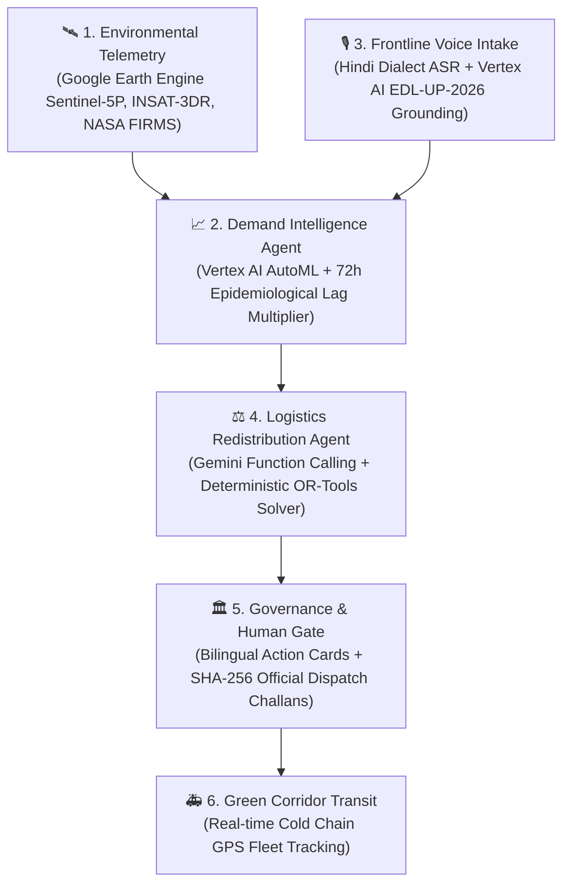
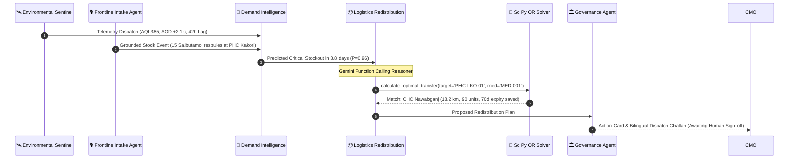

# Aarogya-Vāyu (आरोग्य-वायु)
### *Autonomous Climate-Resilient Rural Health Supply Chain Intelligence Network*

[](https://www.python.org/)
[](https://fastapi.tiangolo.com/)
[](https://deepmind.google/technologies/gemini/)
[](https://cloud.google.com/)
[](LICENSE)

> **Submission for "Build with AI: Code for Communities (2nd Edition)"**  
> **Track 3: Smart Health & Supply Chain Resilience**  
> **Focus Geography:** Lucknow–Unnao Rural Public Health Corridor, Uttar Pradesh, India

---

## 📌 1. The Crisis: India's Rural Medicine Stockout Paradox

In rural India, essential medicine availability across Primary Health Centres (PHCs) and Community Health Centres (CHCs) hovers at only **17% to 51%**, with stockout durations routinely lasting **4 to 14 weeks** (*Journal of Pharmacy & Bioallied Sciences*, 2024).

When acute climate shocks strike—such as post-harvest winter smog inversions across the Indo-Gangetic plain (AQI 350–450+) or pre-monsoon heatwaves (42°C–47°C)—acute respiratory distress and heat exhaustion cases surge by **30% to 50% within 48 to 72 hours**.

### Why Existing Government Systems Fail:
1. **Backward-Looking Static Indenting:** Platforms like *e-Aushadhi* and *DVDMS* rely on 30-to-90-day historical procurement cycles. They cannot predict dynamic, climate-driven patient surges.
2. **The Climate-Health Blindspot:** There is no linkage between environmental early warnings (satellite aerosol optical depth, thermal inversions, heat indices) and facility-level drug demand.
3. **The Surplus-Deficit Paradox:** While **PHC Kakori** runs out of salbutamol respirator respules and turns away breathless children, **CHC Nawabganj** just 18 km away sits on 320 excess units expiring in 70 days. There is **zero horizontal inter-facility coordination**.
4. **Frontline Administrative Friction:** Rural ANMs, ASHAs, and pharmacists juggle heavy clinical loads and avoid complex desktop ERPs. They need frictionless, zero-training reporting in their native language.

---

## 💡 2. The Innovation: The Causal Resilience Loop

**Aarogya-Vāyu** (*AarogyaFlow*) transforms rural healthcare from reactive crisis management into proactive, predictive resilience through a closed causal feedback loop:



1. **Environmental Early-Warning Catalyst:** Ingests satellite aerosol optical depth (AOD), PM2.5, wind speed, and thermal fire hotspots to detect inversion traps before morbidity spikes.
2. **Surge-to-Morbidity Translation:** Translates environmental spikes into forward-looking disease demand (e.g. *AQI 385 with stagnant wind $\to$ 1.62× surge in bronchodilator demand with a 42-hour lag*).
3. **Dialect Voice Intake:** Frontline staff speak a 10-second voice note in Hindi or regional dialects. Vertex AI grounds colloquial terminology to the **Uttar Pradesh Essential Drug List (EDL-UP-2026)**.
4. **Deterministic Mathematical Optimization:** Avoids LLM numerical hallucinations by using Gemini Function Calling to invoke a linear programming solver (SciPy / OR-Tools). Balances inventories within a 35 km radius while prioritizing near-expiry batches to eliminate medicine wastage.
5. **Human-in-the-Loop Governance:** Chief Medical Officers (CMOs) review bilingual Action Cards and authorize dispatches with one click, generating cryptographically sealed (SHA-256) digital challans.

---

## 🤖 3. Google ADK Multi-Agent Architecture

The core of Aarogya-Vāyu is orchestrated via the **Google Agent Developer Kit (ADK)** mesh running 5 specialized autonomous agents:



| Agent | Technology | Responsibility |
| :--- | :--- | :--- |
| **Environmental Sentinel Agent** | Google Earth Engine, Sentinel-5P, Google Maps AQ API | Monitors atmospheric inversion, PM2.5 plumes, NASA FIRMS fire clusters, and weather conditions. |
| **Frontline Intake Agent** | Google Cloud Speech-to-Text v2, Gemini 3.5, EDL Grounding | Transcribes Hindi/dialects, extracts stock counts, grounds terms against EDL-UP-2026, and provides Gemma 2B edge fallback. |
| **Demand Intelligence Agent** | Vertex AI AutoML Tabular Forecaster | Calculates rolling 7-day quantile demand distributions (P10, P50, P90) incorporating epidemiological lag curves. |
| **Logistics Redistribution Agent** | Gemini 3.5 Flash Tool Calling + SciPy Linear Programming | Solves multi-echelon constrained transfer matrices (distance $\le 35$ km, donor safety buffer $\ge 14$ days, cold-chain compliance). |
| **Governance & Strategic Agent** | Gemini 3.5 Flash, SHA-256 Ledger, Web Speech TTS | Prepares bilingual Action Cards, enforces human CMO authorization, and answers parliamentary/strategic policy queries. |

---

## 🧮 4. Mathematical Optimization Model

To guarantee 100% mathematical validity without LLM arithmetic errors, redistribution decisions are solved via deterministic linear programming:

$$\min \sum_{i \in \text{Donors}} \sum_{j \in \text{Recipients}} \Big( c_{ij} \cdot x_{ij} - \omega_{\text{exp}} \cdot \Psi_{ij} \cdot x_{ij} - \omega_{\text{risk}} \cdot \Delta R_j(x_{ij}) \Big)$$

**Subject to:**
- **Distance Constraint:** $d_{ij} \le 35 \text{ km}, \quad \forall (i,j) \text{ where } x_{ij} > 0$
- **Donor Safety Buffer:** $S_i - \sum_j x_{ij} \ge \mu_i \cdot \text{BufferDays}_{\text{min}} \quad (\text{minimum } 14 \text{ days safety stock})$
- **Recipient Deficit Cap:** $\sum_i x_{ij} \le \text{DemandSurge}_j - S_j$
- **Expiry Prioritization ($\Psi_{ij}$):** Weight penalty scaled inversely with remaining shelf-life ($\text{days} < 90$).

---

## 🗺️ 5. The Field Simulation Corridor (20 Facilities)

Aarogya-Vāyu is pre-configured with **20 real, geo-tagged rural health facilities** spanning the high-vulnerability **Lucknow & Unnao** agricultural-industrial corridor:

- **Lucknow District:** PHC Kakori, CHC Malihabad, PHC Bakshi Ka Talab, CHC Chinhat, PHC Gosainganj, PHC Mohanlalganj, CHC Sarojini Nagar, PHC Itaunja, PHC Nigohan, CHC Alambagh.
- **Unnao District:** CHC Nawabganj, PHC Hasanganj, CHC Purwa, PHC Asoha, PHC Bichhiya, CHC Safipur, PHC Bangarmau, PHC Miyanganj, CHC Shuklaganj, PHC Fatehpur Chaurasi.
- **Essential Climate Medicines Tracked:** Salbutamol Respules (Asthma/Smog), ORS WHO Formula (Heat/Dehydration), Dexamethasone Injections (Severe Dyspnea), Paracetamol Infusion (Febrile illness), Amoxicillin+Clavulanate (Secondary infections), Ciprofloxacin Eye Drops (Smog conjunctivitis).

---

## 💻 6. Technology Stack

- **AI & Reasoning:** Google Gemini 3.5 Flash, Gemini 3.5 Flash-Lite, Google Cloud Speech-to-Text v2, Gemini Vision OCR.
- **Agent Mesh:** Google Agent Developer Kit (ADK) / Multi-Agent PubSub Architecture.
- **Optimization Core:** Python SciPy Linear Programming & PuLP Bipartite Matching.
- **Backend Service:** FastAPI, Pydantic v2, Uvicorn (Asynchronous REST API).
- **Frontend Command Center:** Responsive Single-Page Application (HTML5, Tailwind CSS, Leaflet.js, Lucide Icons).
- **Security & Audit:** Cryptographically Chained SHA-256 Audit Ledger, RBAC Authorization Gates.

---

## ⚡ 7. Quickstart & Local Setup

### Prerequisites
- Python 3.10+
- A Google Gemini API Key ([Get one free at Google AI Studio](https://aistudio.google.com/))

### 1. Clone & Configure
```bash
git clone https://github.com/Ritesh-Root/aarogya-vayu.git
cd aarogya-vayu

# Copy environment template
cp .env.example .env

# Edit .env and paste your GEMINI_API_KEY
nano .env
```

### 2. Install Dependencies
Using `uv` (recommended) or standard `pip`:
```bash
# With uv (ultra-fast)
uv sync

# Or with pip & standard virtualenv
python -m venv .venv
source .venv/bin/activate
pip install -e .
```

### 3. Launch Application
```bash
chmod +x run.sh
./run.sh
```
Open your browser at **`http://localhost:8000`**.

---

## 🎬 8. Judge Demo Walkthrough (90 Seconds)

1. **The Smog Alert (0:00 – 0:15):** Observe the top atmospheric bar. AQI is **385 (Severe Inversion)**. On the map, **PHC Kakori** turns amber/red with only 1.7 days of respiratory medicine remaining.
2. **Frontline Voice Logging (0:15 – 0:35):** In the *Frontline Telemetry* card, click **"Test Voice (Hindi)"**. Hear the ASHA nurse report: *"PHC काकोरी से बोल रहे हैं, सांस की दवाई (salbutamol) के सिर्फ 15 रेस्प्यूल बचे हैं, कल 40 मरीज आए थे।"* Watch the system transcribe and ground it to `MED-001 (Salbutamol 2.5mg)` via EDL-UP-2026.
3. **ADK Multi-Agent Orchestration (0:35 – 0:60):** Click **"Run ADK Pipeline (Live Demo)"**. In the terminal window, watch the 4 agents negotiate in real time: Sentinel checks satellite feeds $\to$ Demand Forecaster calculates 42h surge $\to$ Logistics invokes `calculate_optimal_transfer()` $\to$ SciPy solver matches **CHC Nawabganj** (18.2 km away, 90 units, saves 70d near-expiry stock).
4. **Action Card & Governance Approval (0:60 – 0:75):** Click **"Approve & Dispatch"** under Recommendations. An official government transfer challan is minted with a SHA-256 digital seal.
5. **Real-Time Courier Fleet Transit (0:75 – 0:90):** Watch courier van `UP-35-AH-2041` move along the map corridor in real time, delivering stock with cold-chain telemetry intact (4.2°C).

---

## 🛡️ 9. Governance, Privacy & DPDP Compliance

- **Human-in-the-Loop Gate:** No medicine is moved autonomously. AI only recommends; the District Chief Medical Officer (CMO) or designated MOIC holds sole authorization authority.
- **Cryptographic Audit Ledger:** Every voice log, telemetry ingest, model forecast, and transfer approval is appended to an immutable, cryptographically chained SHA-256 ledger (`data/audit_log.json`).
- **Privacy by Design:** Voice intake captures zero patient identifiable data (PID/PII)—only aggregated facility inventory counts and clinical category codes, complying with India's Digital Personal Data Protection (DPDP) Act 2023.

---

## 👥 10. Team & Submission Metadata

- **Event:** Build with AI: Code for Communities (2nd Edition)
- **Track:** Track 3: Smart Health & Supply Chain Resilience
- **Created By:** The Aarogya-Vāyu Engineering Team
